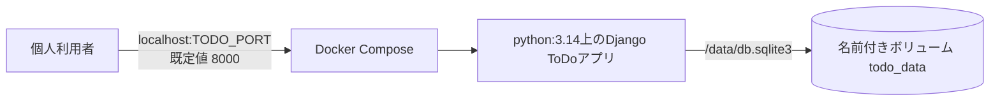
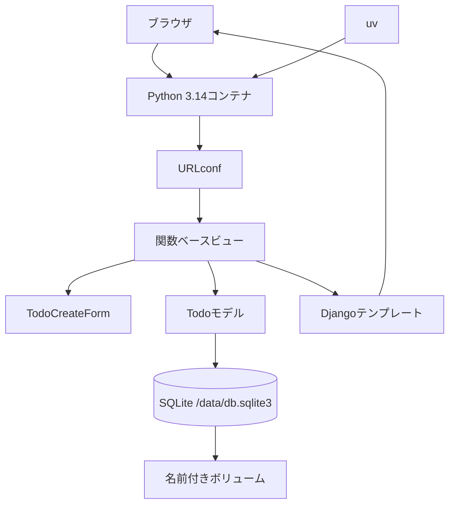
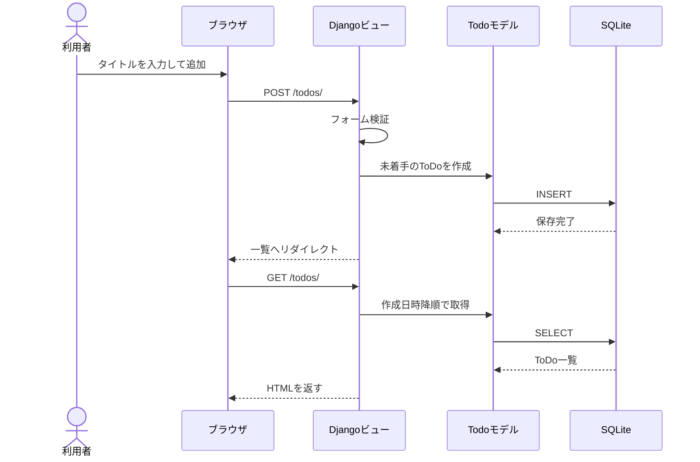
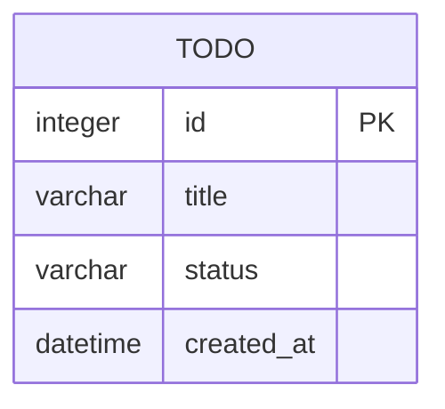
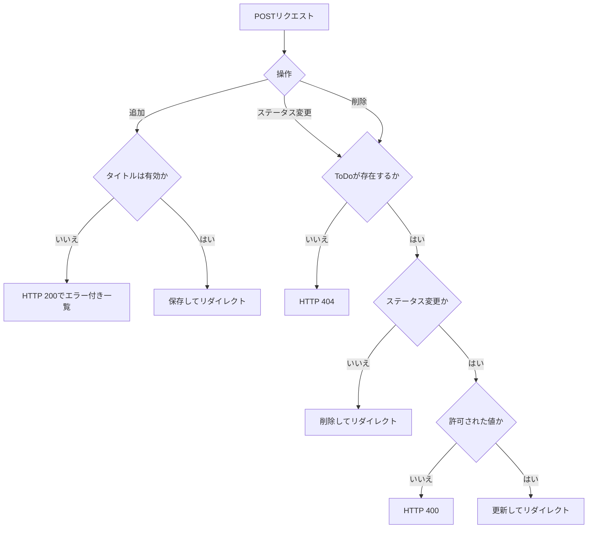

# システムダイアグラム

## 概要

ブラウザと、Docker Composeで起動するDjangoコンテナ、SQLite用の名前付きボリュームで構成するWebアプリケーションである。

## システムコンテキスト図

```mermaid
flowchart LR
    User[個人利用者] -->|localhost:TODO_PORT<br/>既定値 8000| Docker[Docker Compose]
    Docker --> App[python:3.14上のDjango ToDoアプリ]
    App -->|/data/db.sqlite3| Volume[(名前付きボリューム todo_data)]
```

## コンポーネント図

```mermaid
flowchart TB
    Browser[ブラウザ]
    Container[Python 3.14コンテナ]
    UV[uv]
    URLs[URLconf]
    Views[関数ベースビュー]
    Form[TodoCreateForm]
    Model[Todoモデル]
    Template[Djangoテンプレート]
    DB[(SQLite /data/db.sqlite3)]
    Volume[名前付きボリューム]

    Browser --> Container
    UV --> Container
    Container --> URLs --> Views
    Views --> Form
    Views --> Model
    Model --> DB --> Volume
    Views --> Template --> Browser
```

## シーケンス図

```mermaid
sequenceDiagram
    actor User as 利用者
    participant Browser as ブラウザ
    participant View as Djangoビュー
    participant Model as Todoモデル
    participant DB as SQLite

    User->>Browser: タイトルを入力して追加
    Browser->>View: POST /todos/
    View->>View: フォーム検証
    View->>Model: 未着手のToDoを作成
    Model->>DB: INSERT
    DB-->>Model: 保存完了
    View-->>Browser: 一覧へリダイレクト
    Browser->>View: GET /todos/
    View->>Model: 作成日時降順で取得
    Model->>DB: SELECT
    DB-->>Model: ToDo一覧
    View-->>Browser: HTMLを返す
```

## データモデル / 永続化図

```mermaid
erDiagram
    TODO {
        integer id PK
        varchar title
        varchar status
        datetime created_at
    }
```

## エラー時フロー

```mermaid
flowchart TD
    Request[POSTリクエスト] --> Kind{操作}
    Kind -->|追加| ValidateTitle{タイトルは有効か}
    ValidateTitle -->|いいえ| FormError[HTTP 200でエラー付き一覧]
    ValidateTitle -->|はい| Save[保存してリダイレクト]
    Kind -->|ステータス変更| Exists{ToDoが存在するか}
    Kind -->|削除| Exists
    Exists -->|いいえ| NotFound[HTTP 404]
    Exists -->|はい| StatusCheck{ステータス変更か}
    StatusCheck -->|いいえ| Delete[削除してリダイレクト]
    StatusCheck -->|はい| ValidStatus{許可された値か}
    ValidStatus -->|いいえ| BadRequest[HTTP 400]
    ValidStatus -->|はい| Update[更新してリダイレクト]
```
